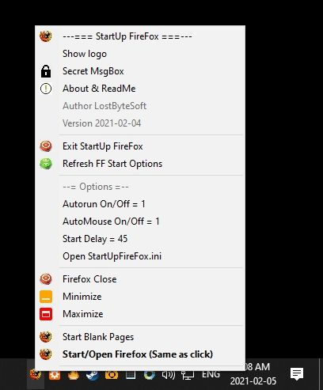
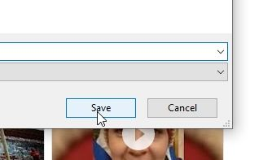

# StartUpFireFox

StartUpFireFox, Auto start firefox when computer start with some options.

You can simply install this software with the file Install.bat

The AutoMouse option move the mouse when the save image box appear.

You can change all options in file StartUpFireFox.ini

Updated: 2021-06-20 to support win 11

----------------------------------------------------

;; start delay in seconds : 0 to 24000
;; also used to no wait if computer is started by the number of seconds in delay

delay=45

;; minimize , maximize not both of them : 0 or 1
;; ONLY 1 CAN BE 1 ALL OTHERS MUST BY 0

maximize=0
minimize=1

path="C:\Program Files\Mozilla Firefox\firefox.exe"

autorun=1

;; save as dialog box mouse move : 0 or 1
;; v

saveas=1

;; Stay blank or about:blank for no pages, if not exist use default

startup=www.fb.com www.google.com

;; debug, 0 or 1, 0 no debug msg, 1 msg

debug=0